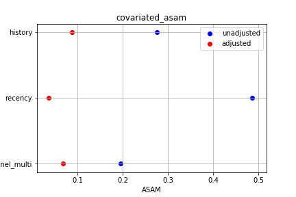

# 因果分析

## 傾向スコア

傾向スコアに関する各種手法をスクラッチから実装

データは以下のものを使用 (メールマーケティングのデータ)

http://www.minethatdata.com/Kevin_Hillstrom_MineThatData_E-MailAnalytics_DataMiningChallenge_2008.03.20.csv

RCTを行ったデータにおける、効果は0.770ドル (メールを送信された人はそうでない人より      
0.770ドル多く消費する)    

人為的にセレクションバイアスのかかったデータを用意した     
このデータにおける効果を回帰分析で出すと、0.97944647     
バイアスのせいで、効果が高く見積もられてしまっている

### 傾向スコアマッチング

usage  

        from propensity_score import Propencity_Score

        # 第一引数に対象のdata frame, 第二引数に目的変数, 
        # 第三引数に介入変数を指定する
        # data frameの他の列は共変数として計算される
        ps = Propencity_Score(biased_df, "spend", "treatment", bins=0.05)
        # マッチングした後の、回帰係数の表示
        ps.get_coefficients()
        # 共変量の標準平均誤差の表示
        ps.plot_asam()

20分割して、マッチングさせた   

効果は0.80820573    

共変数の標準平均誤差は以下の通り    

バイアスの影響を緩和できている