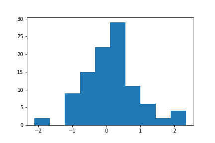
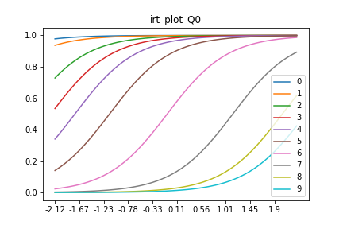
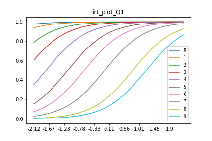
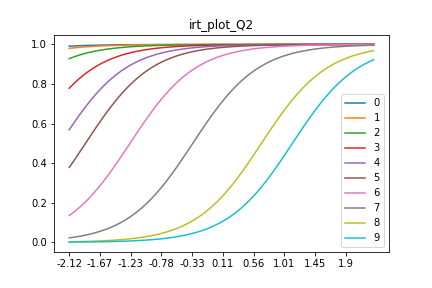
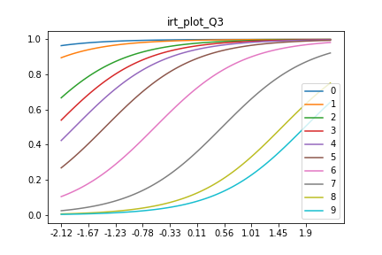
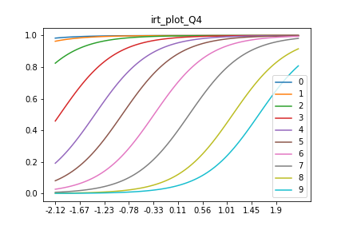

# IRT

IRT stands for Item Response Theory  
https://en.wikipedia.org/wiki/Item_response_theory

## IRT4order (段階反応モデル)

回答が順序変数のモデルを作成した

推定するパラメータは以下の3つ

        特性値（例えば、広告配信の満足度とか）
        識別度母数（項目特性曲線の傾き）
        困難度母数（項目特性曲線の切片

### Usage

    irt = IRT4Order(df, 10)
    irt.set_model(sample=1000)
    irt.model_fit()
    irt.extract()
    irt.plot()

### Example

一目ぼれに関するアンケートの調査結果を使用した  
https://data.world/annavmontoya/speed-dating-experiment

このアンケートの最後の設問 

            "how do you think others perceive you? 
             Please rate yourself how you think others would 
             rate you on each of the following attributes, 
             on a scale of 1-10 (1=awful, 10=great) "

を分析した。
各attributeは以下のとおり

            0. Attractive
            1. Sincere
            2. Intelligent
            3. Fun
            4. Ambitious

基本統計量  

|      | attr5_1 | sinc5_1 | intel5_1 |  fun5_1 |  amb5_1 |
| :--- | ------: | ------: | -------: | ------: | ------: |
| mean | 6.94191 | 7.92723 |  8.28435 | 7.42621 | 7.61761 |
| std  | 1.49865 | 1.62705 |  1.28366 | 1.77913 | 1.77309 |
| min  |       2 |       1 |        3 |       2 |       1 |
| 25%  |       6 |       7 |        8 |       6 |       7 |
| 50%  |       7 |       8 |        8 |       8 |       8 |
| 75%  |       8 |       9 |        9 |       9 |       9 |
| max  |      10 |      10 |       10 |      10 |      10 |

ハイパーパラメータは以下のとおり

            N = 100 (100サンプルを抽出)
            itr = 2000
            chains = 4
            warmup = 1000

#### 能力値の分布

今回の分析対象はアンケートなので、能力値が高いということは  
より大きい数字を選びがちである、ということを意味する

下図のように、小さいが山が右端に存在する。   
この人たちは、適当に回答しているのかもしれない

#### 項目反応曲線 (x軸に能力値、y軸に質問の正答率をとったグラフ)  
(アンケートでは、「正答」=「そのラベルを選択する」となる)  

問題の難易度が上がるほど、曲線がx軸の正方向に平行移動する  
(難易度が高い = 大きい数字を選びづらい)  

また、問題の識別力が高いほど、曲線の傾きが大きくなる  
(識別力が低い = みんなが同じような回答をする)  

基本統計量から分かることと同じように、Q0 (attraction) は高い値を  
つけづらい傾向が分かる  

